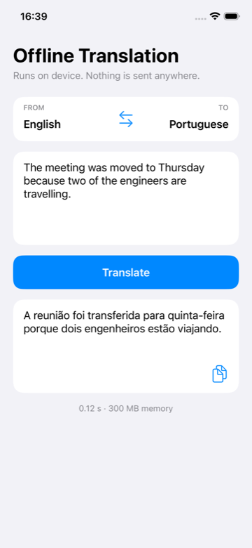
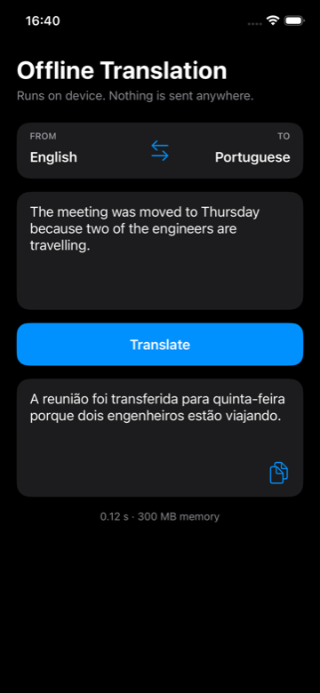

# Lingvanex Offline Translation SDK for iOS & macOS

   

On-device machine translation with no network connection and no data leaving the device.

- **Fully offline** — translation runs on device; nothing is sent anywhere.
- **Fast** — int8 inference with hand-tuned NEON kernels on Apple Silicon and modern iPhones.
- **Private** — no tracking, no analytics, no data collection (see `PrivacyInfo.xcprivacy`).
- **One binary** — the engine, the Objective-C++ bridge and the Swift API ship as a single framework. Nothing to embed or sign separately, no third-party dependencies.

## Requirements

- iOS 13+ / macOS 10.15+
- Xcode 14+
- Translation models (see [Models](#models))

## Installation

### Swift Package Manager

In Xcode: **File → Add Package Dependencies…** and enter:

```
https://github.com/lingvanex-mt/offline-translation-apple-sdk
```

Select **Up to Next Major Version** starting from `4.0.0`.

Or in `Package.swift`:

```swift
dependencies: [
    .package(url: "https://github.com/lingvanex-mt/offline-translation-apple-sdk", from: "4.0.0")
]
```

## Migrating from versions before 4.0

4.0 replaces the public API. The engine and the models are the same; what changed is that the SDK no longer owns storage, queues or global state. Releases before 4.0 are no longer published, so start by pinning `4.0.0`.

**One translator per direction, created directly.** The `Translator.shared` singleton and `setup(fromPackage:toPackage:)` are gone:

```swift
// before
Translator.shared.setLicense(key: key, password: password)
try Translator.shared.setup(fromPackage: from, toPackage: to) { error in … }

// now
let translator = try Translator(
    modelPath: "\(models)/en_pt/1",
    from: "en",
    to: "pt",
    license: License(key: key, password: password)   // omit for plain models
)
```

Loading throws instead of reporting through a completion block, and two directions are two independent instances rather than one global that reloads.

**Calls are synchronous.** `translateWithString(_:queue:translateBlock:)` became `try translate(_:)`, which blocks until it is done and no longer hops queues for you:

```swift
// before
Translator.shared.translateWithString(text) { result in … }

// now
DispatchQueue.global(qos: .userInitiated).async {
    let translation = try? translator.translate(text)
}
```

**Non-English pairs are chained explicitly.** The old `setup` loaded two engines and pivoted through English internally. Now you create both translators and feed one result into the other — see [Translating between two non-English languages](#translating-between-two-non-english-languages).

**You own the model files.** `PackageManager` and `Package` are gone, and with them the SDK-managed `Caches/Packages/<id>_<version>_<code>/` folder and the bundled zip dependency. Unpack the archive wherever suits your app and pass the direction's folder as `modelPath`. The layout is flat now (`models/en_pt/1/…`), so models installed by 3.x are not picked up: unpack the new archive and delete the old `Packages` folder.

**Settings live on the instance.** `setBeamSize(_:)` and `setChunkSize(_:)` were global; use `translator.beamSize` and `translator.chunkSentences`. `cancelCurrentTranslation()` became `translator.requestCancel()`, which cancels that translator only.

**Errors are one type.** `PackageManagerError` is gone and everything throws `TranslatorError` — see [Errors](#errors). There is no `emptyString` case any more; empty input is no longer a special case.

The API is Swift-only: nothing is exposed to Objective-C, where 3.x had an `@objc` surface.

## Models

Translation models ship separately as a `.zip` archive. Unpacked, it is a flat folder with one subfolder per direction — the same layout on every platform we support:

```
models/
├── en_pt/1/…      English → Portuguese
├── pt_en/1/…      Portuguese → English
├── en_ru/1/…
└── ru_en/1/…
```

One archive can carry as many languages as you order. Every language translates to and from English; English itself is built in, and a pair without English goes through it.

**High-quality offline models are available for 110 languages.** To request a demo archive for the languages you need, write to **info@lingvanex.com**.

**Sample Portuguese models** (English ↔ Portuguese, 87 MB) are ready to try right away: [download pt.zip](https://github.com/lingvanex-mt/offline-translation-apple-sdk/releases/download/sample-models/pt.zip). The `Example/` apps fetch them themselves on first launch; in your own app either bundle the archive (drag it into the project with Copy If Needed and your target checked) or download it at runtime — both are shown below.

Both directions come from our current mobile model generation (46.9 MB each, int8). Measured through this SDK on FLORES-200 devtest, 1012 sentences, beam 2, Apple M1 Pro:

| | English → Portuguese | Portuguese → English |
|---|---|---|
| BLEU | 52.31 | 47.27 |
| chrF2 | 71.56 | 69.45 |
| COMET-DA | 0.899 | 0.886 |
| Speed | 78 ms/sentence | 77 ms/sentence |

## Quick start

Unpack the archive once, then load the direction you need:

```swift
import OfflineTranslator
import ZIPFoundation

// 1. Unpack the bundled archive. Do it once — keep the unpacked folder and skip this on
//    the next launch. Caches are a good place for it: the models can always be unpacked
//    again, and iOS is allowed to evict them when the device runs low on storage.
//    The SDK does not unpack archives — any zip library works; this uses ZIPFoundation.
let caches = FileManager.default.urls(for: .cachesDirectory, in: .userDomainMask)[0]
let models = caches.appendingPathComponent("models")
if !FileManager.default.fileExists(atPath: models.path) {
    let archive = Bundle.main.url(forResource: "models", withExtension: "zip")!
    try FileManager.default.createDirectory(at: models, withIntermediateDirectories: true)
    try FileManager.default.unzipItem(at: archive, to: models)
}

// 2. Load one direction — the folder of the pair, as it comes in the archive.
//    Encrypted models also need a license — see Encrypted models below.
let translator = try Translator(
    modelPath: models.appendingPathComponent("en_pt/1").path,
    from: "en",
    to: "pt"
)

// 3. Translate. Loading and translating take seconds — keep them off the main thread.
let translation = try translator.translate("Hello world! How are you today?")
print(translation)   // "Olá mundo! Como estás hoje?"
```

The model stays in memory while the translator is alive; release the translator to free it.

### Models downloaded at runtime

Nothing about the SDK ties models to the app bundle: fetch the zip with `URLSession` and unpack it with the zip library of your choice — the demo uses [ZIPFoundation](https://github.com/weichsel/ZIPFoundation). `ModelsDownloader` in `Example/Shared/Models.swift` does exactly that for the sample models, with progress; point it at your own server to fetch commercial models the same way.

### Translating between two non-English languages

The engine loads one direction at a time, so a pair without English is two translators chained through English:

```swift
let deToEnglish = try Translator(modelPath: dePath, from: "de", to: "en")
let englishToPt = try Translator(modelPath: ptPath, from: "en", to: "pt")

let english = try deToEnglish.translate(germanText)
let portuguese = try englishToPt.translate(english)
```

`Example/Shared/Models.swift` does exactly this in about two hundred lines — installing an archive, listing what is installed and pivoting through English. Copy it into your app and adapt it.

## Encrypted models

Models come in two flavours and the SDK reads both:

- **Plain models** — the sample models and every demo archive. Nothing to configure.
- **Encrypted models** — commercial models whose files are encrypted. They need the license key and password we issue with them:

```swift
let license = License(key: "<license key>", password: "<password>")
let translator = try Translator(modelPath: path, from: "en", to: "pt", license: license)
```

The two modes are exclusive: plain models load without a license, encrypted ones only with a matching license. Getting it wrong fails with `TranslatorError.modelDecryptionFailed`, not with a wrong translation.

Licenses expire. The expiry is checked when a direction is loaded and is available as `translator.licenseExpiresAt`; the engine does not re-check it afterwards, so an app that stays open for days should compare that date against the clock before translating. A license issued for a specific machine is loaded with `License(key:password:isDeviceBound: true)`; the identifier it is issued for is `TranslatorInfo.hardwareID`.

To check a license before any models are on disk — on an activation screen, say — call `try license.validate()`, which returns its expiry date.

## API

### Translator

One loaded direction of translation.

| Member | Description |
|---|---|
| `init(modelPath:from:to:license:)` | Loads the model for one direction. Throws if the model is missing or the license does not match it. |
| `translate(_:)` | Translates a text, splitting it into sentences internally. |
| `translateDocument(at:to:)` | Translates a document file (macOS only, see below). |
| `requestCancel()` | Stops the translation in flight at the next batch boundary; it throws `TranslatorError.cancelled`. |
| `licenseExpiresAt` | Expiry of the license the direction was loaded with, `nil` without one. |
| `beamSize` | Decoder beam width. Default `2`. `1` (greedy) is ~25% faster with near-identical quality — recommended on iPhone. |
| `chunkSentences` | Sentences per inference batch, which is also the cancellation granularity. Default `4`. `0` puts the whole text in one batch — up to 2× faster on long texts, but cancellation only works between calls. |

Calls on one translator are serialized internally, so a translator can be shared between threads; two translators run independently.

### TranslatorInfo

| Member | Description |
|---|---|
| `version` | Engine version with the short commit it was built from. |
| `buildTimestamp` | Build time, ISO 8601. |
| `hardwareID` | Device identifier a device-bound license is issued for. |
| `supportedDocumentFormats` | Document formats this build understands. Empty on iOS. |

### Documents

macOS and Mac Catalyst builds translate `docx`, `odt` and `xml` documents:

```swift
try translator.translateDocument(at: sourceURL, to: targetURL)
```

iOS builds ship without document translation — it pulls in a document parser that has no place on a phone — so `TranslatorInfo.supportedDocumentFormats` is empty there and the call fails with `TranslatorError.notSupportedInThisBuild`. Check the list instead of hardcoding extensions.

### Errors

Everything throws `TranslatorError`; `localizedDescription` is safe to show to users.

| Case | Meaning |
|---|---|
| `licenseEmpty` | Only one of key/password was given. |
| `licenseMalformed` | Key or password is wrong. |
| `licenseSignature` | License signature does not verify. |
| `licenseExpired(expiresAt)` | License has run out. |
| `licenseClock` | License is not valid yet — usually a device clock set to the past. |
| `modelDecryptionFailed` | License and models do not match: encrypted models without a license, or a license against plain models. |
| `cancelled` | Translation was stopped by `requestCancel()`. |
| `notSupportedInThisBuild` | The feature is not compiled into this slice — document translation on iOS. |
| `unsupportedDocumentFormat(format)` | The format is not in `supportedDocumentFormats`. |
| `notInitialized` | The engine was used without a loaded direction. |
| `native(message)` | Anything else the engine reported, with its original message. |

## Memory guidance

Each loaded direction holds its model in memory. Mobile-sized models like the Portuguese sample cost about 75 MB per direction (measured on an iPhone 12 simulator: 73 MB for the model, 210 MB for the whole app); our full-size models cost around 330 MB. A non-English pair loads two models, so it doubles that. On devices with 4 GB RAM or less, prefer pairs involving English and release the translators when the translation UI is dismissed.

## Example

`Example/` contains iOS and macOS demo apps. Open `Example/Example.xcodeproj`, pick `Example-iOS` or `Example-macOS`, build and run. On first launch the app downloads the sample Portuguese models (87 MB) into its caches and unpacks them — nothing else to set up. They stay on the device, so the next launch is offline.

To run without a network, or to try your own models, drag the archive into the project (tick **Copy items if needed** and the target you run): the apps install every `.zip` in their bundle and skip the download when models are already there.

<p align="center">
  
  
</p>

Adding languages needs no code change: drop `models.zip` into the project and every language it carries appears in the pickers — including the non-English pairs, which the example pivots through English. Archives are merged, so a second one adds its languages to the first.

Nothing forces the models through an archive, either: on iOS and macOS the app bundle is a real folder on disk, so you can drag the unpacked `models` folder in and read it straight from `Bundle.main` — no unpacking at launch and no second copy in Caches. Drag it in as a **folder reference** (the blue one), not a group: a group adds the files individually and the `model.bin` of every direction lands in the same place.

## Getting more languages

Offline models are available for **110 languages**. For a demo archive, pricing, or help picking the right model size for your app, write to **info@lingvanex.com** or visit [lingvanex.com](https://lingvanex.com).

## License

The SDK is released under the [MIT license](LICENSE). Models are licensed separately — write to **info@lingvanex.com**.
